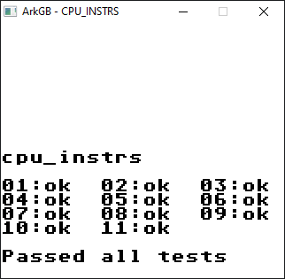
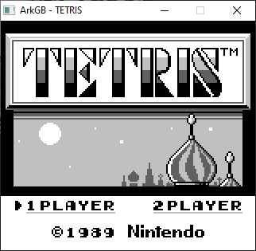
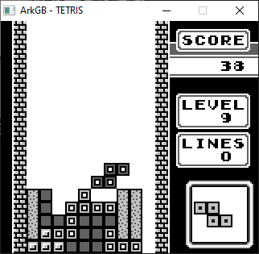
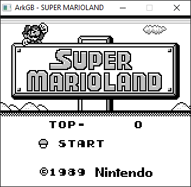
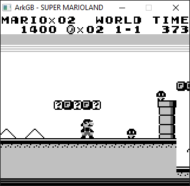
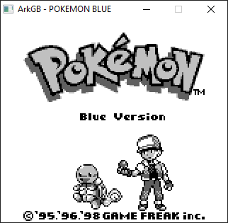
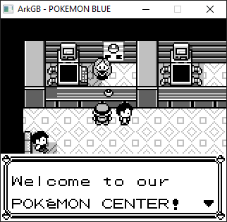

# ArkGB

ArkGB is a gameboy emulator written in C++, supported by the SDL library. I started this project to learn more about hardware, emulation, and to develop my C\C++ coding skills. 

## Building

The emulator was built with mingw32 GCC and MAKE in windows. The project can be built by running `make` in the main directory which will produce the executable.

NOTE: you will also need the mingw32 version of the SDL libary - the `INC_PATH` and `LIB_PATH` makefile variables should reflect the location of the SDL include and library files respectively.

## Usage

`Usage: ArkGB.exe rom.gb(c)`

Key Mappings: <kbd>&uarr;</kbd>, <kbd>&darr;</kbd>, <kbd>&larr;</kbd>, <kbd>&rarr;</kbd>, <kbd>S</kbd>, <kbd>A</kbd>, <kbd>Enter</kbd>, <kbd>Backspace</kbd>.

## Features

* Fully emulates the original gameboy CPU:
    * Complete instruction set (base and extended)
    * Passes blaarg CPU tests
    * Full support for CPU interrupts
* GPU
* Audio
* Timer + DIV counter
* Joypad
* Battery-backed game saves

## Future Goals

* Cross-platform support
    * Developed and tested on Windows using the GCC compiler
    * In theory, should be portable to other OS's that support GCC and the SDL libary, but haven't tried yet
    * Support for CMAKE
* Shift from C style coding to more modern C++ style/features and OOP design patterns
* Automated testing for builds
* Gameboy color support
* Add debugging UI widgets (ROM disassembly, breakpoints etc)
* Customizable key mappings
* Serial cable support
* Memory snapshots
* Bootstrap ROM support
* Complete support for all MBC types
    * MBC 0 and 1 supported
    * MBC 3 partially supported (RTC clock needs to be implemented)
* Pass ALL blaarg emulator tests (currently failing some audio tests)

## Tests

Currently passing all blaarg CPU tests:

## Screenshots

Menu | Gameplay
:-------------------------:|:-------------------------:
 | 
 | 
 | 

## Resources

* [GameBoy CPU manual](http://marc.rawer.de/Gameboy/Docs/GBCPUman.pdf)
* [BGB emulator](http://bgb.bircd.org/) --- one of the "Gold Standard" emulators currently available, used to help with testing/debugging ArkGB
* [Pandocs](https://gbdev.io/pandocs/)
* [Javascript GB emulator](https://imrannazar.com/GameBoy-Emulation-in-JavaScript:-The-CPU) -- excellent series of articles describing the development of a GB emulator in javascript
